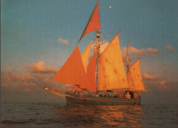

+++
title = "Interview"
date = "2024-03-15"
draft = false
pinned = false
tags = ["Interview", "Segeltour", "Drogenabhängige"]
image = "img_0028.jpeg"
description = ""
+++
# ***Weg von den Drogen*** ***in einen neuen Lebensabschnitt segeln***

## *Die Segeltour als Therapie für Exdrogenabhängige*

Segelschiff Tectona

> ***Befragte Person:*** 
> Thérèse Zöller (Pseudonym, auf Wunsch der Befragten Person wurde der Name geändert) Sie ist 73 jährig und lebt am Thunersee. Schon immer war sie begeistert von Schiffen und liebte das Meer, selbst hat sie mit ihren Söhnen ein Segelpadent für auf offene See absolviert.\
> Sie ist Sozialpädagogin und als Begleiterin auf der Segelturn mit Exdrogenabhängige dabei. In diesem Interview erzählt sie von ihrer Reise auf der Tectona im Jahr 1994.

***\-Wie ich gehört habe, nennt man dich „alter Seebär“ wieso beschreibt man dich so?***
Ich gehe davon aus dass diese Titel Alter Seebär eben daher rührt, weil ich sehr begeistert war mit all den Dingen die Geschahen wärend dieser Reise. 
Es ging darum das die Arbeit auf dem Schiff Präzision, Gegenwart und Aktivität erforderte. Man muss dabei sein. Also es geht nicht dass man lauert wie wir sagen, wenn die Fahrt erfolgreich sein soll, das macht ein alter Seebär aus. 

***\-Woher kommt deine Leidenschaft für das Meer und das Segeln?*** 
Das Meer war immer ein Anziehungspunkte für mich. Ich habe mit meinen 3 Söhnen das Segelpatent auf der See auf den Schweizer Seen erworben. Und später, mit der Unterstützung von meinem Sohn Robert, noch die Theorie für den See Ausweis also See gleich Meer Ausweis. Und wie ich den hatte, meldete ich mich bei der Plus Schweizer Jung zur See, mit der Bitte sie sollen mich auf so einen Törn als Mitarbeiterin schicken. 

***\-Was war das für eine Schifffahrt auf der du dabei warst?*** 
Einer meiner vielen Arbeitsstellen meiner Erwerbstellen als Sozialpädagogin fand auf der Tectona statt, das ist ein Segelschiff, das von der Organisation Plus Schweizer Jugend zur See, geführt wurde. Auf diesem Schiff fanden Turns statt, die mit Jugendlichen, nach dem Drogenentzug, einen Turn fuhren als Therapie. Auf dem Schiff waren mehrere Betreuer und Jugendliche. Sieben Monate, September 1994 bis März 1995, waren wir zusammen auf der Summertörn unterwegs.

***\-Welche Route seid ihr mit dem Schiff gefahren und was habt ihr auf dem Weg entdeckt?***
Von Mulin fuhren wir mit dem Zug über die Alpen. Dort sattelten wir die Velos und fuhren nach Villanueva bis zum Schiff, um sportlich aktiv zu sein, als Therapie für die Jugendlichen. Das Schiff war in Villanueva Spanien, das ist 30 Kilometer südlich von Barcelona. Da ging es das Mittelmeer runter und ankerten in Seeuta, das ist eine spanische Enklave auf dem afrikanischen Kontinent. Von Seeuta ging es dann weiter durch die Straße von Gibraltar zu Saopaulo der Inselgruppe von Madeira. Da hatten wir pech mit dem Wetter, es zerschlug ein Teil des Schiffs, das bevor wir weiterfahren konnten repariert werden musste. Dann nach Madeira und von Madeira runter zu den Kapverden. Und von den Kapverden rauf zu den Azoren. Von da aus steuerten wir auf Tanger zu. Weil wir dort ein Dokument stempeln mussten, dies war eine versicherungstechnische Frage, da wir ausserhalb der Europäischen Grenze am Segeln waren. Wir erreichten Tanger nicht, wir kehrten halbwegs zurück und gingen dann ins Mittelmeer. Hier konnten wir erneut wegen der Wetter und Windbedingungen nicht direkt nach Villanueva zurück. Wir mussten den Umweg fahren über die Balearen und dann nach den Balearen kamen wir wieder in Villanueva an. Von dort ging es dann per Zug nach Zürich, nach Hause.

***Was war das für ein Schiff auf dem ihr wart?*** Das Schiff hiss Tectona und war 1929 in Indien erbaut worden. Sie heisst Tectona, weil sie aus Tickholz erbaut wurde. Sie ist 24 Meter lang und acht bis zehn Meter breit. Ein kleines feines Segelschiff. Das Segelschiff war ursprünglich ein Segelschiff ohne Motor. Der Motor wurde im Nachhinein eingebaut. Normalerweise ist bei einem Schiff die Schiffsschraube gerade reingebaut, hier wurde es aber schräg eingebaut. Dies führt zu einem speziellen Seegang, weil das Schiff anders reagiert auf die Wellen und dem Wind, auf welches man beim Segeln achten muss.

***\-Wie hast du Zugang bekommen bei dieser Schifffahrt dabei zu sein, wie konnte man sich anmelden?*** 
Eine meiner Freundinnen war Bereichsleiterin. Sie war Verantwortlich für die Vorbereitung die Begleitung und die Nachbereitung der Turns, die zweimal im Jahr stattfanden. 
Ich wollte wissen was hinter diesen Turns steckt, also ging ich zu meiner Freundin und fragte ob ich   auf so einem Turn mitfahren kann als Mitarbeitende. 

***\-Was hat dich gepackt und motiviert dabei zu sein?***
Ich träumte schon lange vorher, von den Bergen zum Meeresstrand zu gellangen und in die Ferne zu schauen, den Abenteuer entgegen. Das offene Meer zu besegeln und die Inseln weit draussen zu entdecken. Jahre später setzten sich diese Träume um.
Das hat dich dann zu dieser Segelfahrt geführt.

***\-Was waren die Rollen der Begleiter?***
Der Skipper ist der Kapitän, er hat die Verantwortung auf dem Schiff und die Fahrt, also alles Nautische oblag ihm. Der Coskipper stiess in Vilanueva dazu, er arbeitete auf dem Schiff und unterstütze den Skipper. Die Zahlmeisterin hatte dafür zu schauen, dass unser Geld korrekt ausgegeben wird. Das die Buchhaltung, das Journal der Ausgaben, korrekt geführt wird. Ihre Herausforderung war es das es damals noch die verschiedenen Währungen in den verschiedenen Ländern gab, also Frankreich, Spanien, Portugal.
Die Pädagogische Leitung die verantwortlich ist für alles was mit den Jugendlichen passierte und sich um die Jugendliche kümmerte, das oblag mir.

***\-Was für Aufgaben habt ihr gemacht damit ihr euch besser kennenlernt?*** 
Es ist die Aufgabe der Erwachsenen, dafür zu sorgen dass diese Team Findung stattfinden konnte, so dass man sich kennenlernte. 
Wir haben den Alltag der ganz einfache Alltag erlebt. Es ist von grosser wichtigkeit dass man sich gegenseitig kennenlernt Schwächen und Stärken. Weil wenn du dann auf dem Schiff bist, ist es gut und hilfreich, wenn du eine Ahnung hast wie der andere tickt.
Und das waren ja alles Jugendliche nach dem Drogenentzug und wenn du einen Drogenentzug machst, dann bist du noch weit entfernt von clean, wir hatten dort 7 Flöhe. Die alles daran setzten uns hinters Licht zu führen, um wieder an Drogen zu kommen. Das war unsere Aufgabe, zu schauen, dass die Drogen draussen bleiben und dass ist uns nicht ganz gelungen, darum spreche ich von Flöhen. 

***\-Wie war das Team, wie hast du es erlebt im Team?***
Die Team Zusammensetzung war phänomenal, ganz perfekt durchmischt. Es sind 4 Erwachsenen mit 7 Jugendlichen 2 Frauen 5 Männer.

***\-Wie wurden die Passagieren ausgewählt, also die die drogenabhängig waren?***
Eine sehr spannende Frage, Plus Schweizer Jugend zur See, war eines der Segelangebote in der Schweiz das mit Jugendlichen nach dem Drogenentzug eben die Therapie fuhr. Das war eine Form von Therapie, eine harte Form der Therapie. Sozialdienste zum Beispiel oder andere Institutionen die von Jugendlichen wussten dass nach dem Drogenentzug eine Therapie angeschlossen werden sollte, weil wenn du aus dem Drogenentzug kommst, dann hast du das reißen. Also da muss man eine Therapie machen, wo man eingebunden ist. Eine anschließende Therapie ist wichtig. Wir hatten Zulieferer vom Jugendanwaltschaften  die während Jahren mit diesen Jugendlichen zu tun hatten und immer wieder Rückfälle um Rückfall. Soeben auch die Sozialdienste oder die Institutionen die sich mit solchen Jugendlichen Beschäftigten, die dann beschlossen eine solche Therapie ist angezeigt. Und klar brauchte es die Einwilligung der Jugendlichen dieses Angebot überhaupt anzunehmen. Man musste denen erzählen um was es geht, das das nicht einfach Schoko schlecken sein wird, dass sie herausgefordert werden. Bei den Jugendanwaltschaften war manchmal schon ein wenig Druck dahinter, „entweder du gehst aufs Schiff oder du gehst in den Knast“.
Wieso in den Knast? Wenn sie wieder auf die Straße gingen und dielten und erwischt wurden also legale Handlungen erneut machten. Also bis ein Jugendliche bei der Jugendanwaltschaft Anlangte braucht es sehr viel. Darum war die Jugendanwaltschaft schon etwas streng. 

***\-In welchem Alter waren diese Jugentliche?*** 
Auf unserem Schiff auf unserem Törn, hatten wir Jugendliche von 17 Jahren bis 25 Jahren.

***\-Wie war es unter den Jugendlichen, haben sie sich angefreundet?***
Erneut Haufen Flöhe also da war extrem viel los. Sie schlossen sich zusammen also egal wie viele Herausforderungen sie untereinander hatten, wie das Halt in einer Peer Gruppe ist. Es kam dann irgendwann die Phase, wo sie sich zusammenrotten gegen uns Erwachsene und das wurde schwierig. 
Sie haben sich zusammengesetzt damit sie stärker sind? Ja 

***Wie hat sich dann auf dem Weg die Dynamik entwickelt?*** 
Gibt es Geschichten, die du erzählen möchtest.
Ja vielleicht beginne ich bei einem ersten Beispiel, aber es gibt wirklich verschiedene wiederholte Beispiele. Das erste Beispiel passierte in der Mulin, wo wir denn Auftrag hatten, eben Teamfindung. Das war so weit entfernt oben in den Bergen, in der Hoffnung da kommen keine Drogen hin, ja denkste, die sind clever genug. Also eines nachts kommen ein Mädchen und ein Junge zu mir. Panisch bringen sie mich zum Jüngsten der Teilnehmenden. Der liegt bewusstlos in seinem Kot, das ganze Bett voll Kot. Was war geschehen, die haben es geschafft Alkohol in die Hütte reinzubringen, an uns vorbei wir hatten das nicht mitgekriegt. Die füllten ich nenne ihn das Jüngelchen, weil das war der 17 jährige, die füllten das Jüngelchen ab, bis er in Delirium (stelierium) viel und das kann tödlich enden. Also ich hab da Blut geschwitzt und weil sie ein schlechtes Gewissen hatten halfen diese Frau und dieser junge Mann mir diesen Jungen zu waschen, zu Duschen, von seinem Kot zu befreien, die Leintücher zu entfernen, das Bett frisch anziehen und ihn dann wieder ins Bett zu legen. Also das war ein absolut kritischer Moment und so gab es eben mehrere Geschichten.

Eines nachts wurden wir, die Erwachsenen geweckt, die Polizei stand vor dieser Schlafstätte und befahl uns Erwachsenen mit auf den Polizeiposten zu kommen. Was war geschehen, die Jugendlichen waren weg. Wir wurden also auf den Polizeiposten geführt und da waren all die 7 Jugendlichen. Was war geschehen, am Tag vorher war es ihnen wieder einmal mehr gelungen zu Alkohol zu kommen. Wieder an uns vorbei und zwar in Tetrapacks. Wein, Rotwein in Tetrapacks. Wir erwischten sie und sie mussten diesen Wein die Tetrapacks öffnen und ins WC runterspülen, sämtliche Tetrapacks.
Rache ist süss, sie kitteten zusammen, sie beschlossen zur rasch zur Garage zu gehen. Die Garage hatte einen großen Hinterhof, in diesem Hinterhof versuchten die männlichen Jugendlichen das Auto kurz zu schließen. Will heißen wenn man weiß wie kann man die Drähte nehmen und zusammenführen und dann springt der Funke über dort beim Schlüssel vom Auto und dann kannst du wegfahren. Die Frauen, die hatten die Aufgabe am Trottoir Rand Wache zu halten, falls jemand kommt, hätten sie den Jungs Alarm schlagen müssen. Die schliefen aber ein, die sassen schlafend am Strassenrand. Die Nachbarschaft wurde durch den Lärm, denn die Jugendlichen verursachten geweckt und riefen die Polizei. Die Polizei sammelte die sieben Flöhe ein und brachte sie auf den Posten. Der Skipper und ich pädagogische Leitung wir wurden auf den Posten mitgenommen. Ich war so wütend und brauchte lange Zeit, bis ich dem Beamten den Gappo klargemacht hatte, wen es um die Jugendlichen geht, bin ich zuständig und nicht der Skipper. Wir sind in Spanien Macho, Frau pfff also geht man zum Skipper, der hat das Sagen, nein hat der in diesem Fall nicht. In diesem Fall bin ich zuständig, also wir brauchten lange Zeit bis der Kapo schluckte dass er mit mir verhandeln darf. Ich war so wütend ich hab dem gesagt, weißt du was, du behältst die. Über Nacht bleiben die hier bei dir in der Kiste. Nein kommt überhaupt nicht in Frage, jetzt ging der zweite Kampf los. Ich ging davon aus hier in der Schweiz gibt es sowas wie Untersuchungshaft. Um etwa 03:00 Uhr morgens sagte der Kapo weist du was ich bin müde, ich bringe euch nach Hause mit den Flöhen, die behalten wir nicht. Ich bringe euch alle zurück zur Schlafstätte, wir holen euch morgen um 08:00 Uhr wieder ab damit wir weiter streiten können. Hat er gemacht, er ist uns abholen kommen und da hat er mir erklärt in Spanien wenn er die Jugendlichen eingebuchtet hätte, die wären so rasch nicht wieder rausgekommen. Das hätte ein riesengrosses Primborium, rechtlicher Natur gegeben, mit Richter, mit weis nicht was anderem und das wäre das Ende unserer Reise gewesen. Dann wären wir nicht einmal auf dem Schiff angelangt.

***\-Wie wurde das Vertrauen dann aufgebaut untereinander, wurde das irgend mal aufgebaut?***
Es gab immer wieder andere Seilschaften sowohl unter den Jugendlichen wie unter den Erwachsenen. Die Zahlmeisterin wurde von den Jugendlichen erwischt beim Drogenkonsum auf dem Schiff. Mir war schon vorher klar irgendetwas stimmte nicht, ich stand Nacht für Nacht am Deck des Schiffs in der Hoffnung ich könnte herausfinden was es ist, gelang mir nicht. Wie wir gegen die Kapverden kamen spürten wir dass es eine schwierige Situation gab, die Jugendlichen wollten uns noch weniger gehorchen die machten uns den Stinkefinger, wenn wir etwas von ihnen forderten. An einem Punkt wollte auch die Zahlmeisterin etwas durchsetzen das nicht in unserem Programm lag, sie wollte das Schiff mit dem Dingi verlassen und der Captain also der Skipper sagte Nein. Und dann kamen wir den Kapverden näher und eines Tages kommt der Skipper zu mir und sagt mir, dass eine der Jugendlichen Mädchen ihm erzählt hat dass die Jugendlichen die Zahlmeisterin beobachtet haben wie sie Drogen konsumiert. Und da war klar, die Jugendlichen hatten die Zahlmeisterin in der Hand, die konnten dem Skipper und mir den Stinkefinger zeigen. Auf Mindelo, erfuhren wir dies und ich beschloss solange die an Board ist bewegen wir das Schiff nicht mehr. Weil unsere Autorität war untergraben. Sie musste dann gehen und wir sassen einen Monat auf Mindelo. Bis wir Nachschub an Erwachsenen erhielten. Weil Zürich entliess die Zahlmeisterin sofort, also fristlos. Es musste ein Zahlmeister/in gefunden werden und als der Coskipper erfuhr, dass sie gehen musste sagte er dann geh ich auch. Jetzt waren wir nur noch 2 Erwachsene. 

***Und dort ging vertrauen verloren, bei den Jugendlichen weil es unter den Erwachsenen missbraucht wurde?*** 
Also der Kapitän (Skipper) und ich waren jetzt wirklich ein Team, das zusammenhielt und die Jugendlichen hatten jetzt kein Pfand mehr in der Hand.
War das wahrscheinlich die ganze Zeit schon ein Problem das ihr gehabt habt und deswegen konnten sie so viel schlechtes machen? Ja
Der Skipper und ich wir haben Sie bereits in Zürich erwischt beim Drogenkonsum und meine erste Reaktion war ich renne zu meiner Freundin der Bereichsleiterin. Ich rätsche oder täffele wie man auf Zürichdeutsch sagt, ich verrate die Zahlmeisterin, dass sie eben Drogen konsumiert. Ein zweiter Gedanke war dann, halt Moment wir sind 3 Erwachsene Menschen. Der Skipper, die Zahlmeisterin und ich wir saßen zusammen und offenbarten ihr, dass wir sie erwischt hatten beim Drogenkonsum. Dann sagte sie „Das ist überhaupt kein Problem, das mach ich so manchmal hin und wieder, das kann ich lassen. Ich bin nicht von dem abhängig“. Der Skipper verlangte eine Zusage von ihr und wir beschlossen, ok schwamm darüber. Wir wollen den Turn nicht gefährden, denn das hätte zum Abbruch des Projekts führen können. Aber auf Mindelo musste sie dann fristlos gehen.
Das war ein sehr schlechtes Beispiel für die Jugendliche, weil sie auf diesem Weg sind, um den Drogenkonsum loszuwerden und sie hat dies wieder reingebracht.
Also das war ein sehr schlechtes Beispiel für die Jugendliche. 
Haben sie auch daraus gelernt, das sie als konzequenz gehen musste? 
Ja, du wirst erwischt und dann fertig. Dass war eine Möglichkeit daraus zu lernen, die Folge war das wir einen Monat auf Mindelo festsassen. 

\***\-Was für Auswirkungen und Bereicherung hatte diese Reise für die Drogenabhängigen?***
Sie hatten die Gelegenheit zu lernen wie sich das Leben abspielt, Verantwortung zu übernehmen, Zuverlässigkeit zu übernehmen, Bereitschaft zur Hilfe, aufeinander acht zu geben und einander zu helfen wenn du in Not bist. Das war eine hervorragende, harte Schule. Braucht da kannst du nicht einfach zurücklehnen und sünele.
Gab es Fortschritte die du an Board miterlebt hast?
Ein möglicher Fortschritt war für die Spanierin, als wir in den südlichen Gewässern fuhren, hatten wir fliegende Fische. Die fliegenden Fische können sehr hoch und sehr weit springen und es gab solche die sprangen von der einen Seite, vom vorderen Teil des Schiffs und versuchten über das Schiff hinüber auf die andere Seite ins Meer zu springen oder zu fliegen und dann landeten einige Halt an Deck und verelendeten jämmerlich. Und die Spanierin ist Katholikin und das war des Teufels. Die war in Panik der „Teufel kommt uns holen“ und die Gruppe versuchten ihr klarzumachen, glaube hin oder her, diese Fische die springen die Fliegen buchstäblich und das hat mit dem Teufel nix zu tun. Und mit einigen zureden, konnte sie sich dann beruhigen.

Ein weiteres Beispiel das Jüngelchen liebte das Fischen. Er warf hinten am Heck seine Rute raus, also einfach eine Leine mit Haken und fischte Tag für Tag für Tag Feste raus und am Anfang war das wunderbar, wir hatten Fisch bis sie uns zu den Ohren rauskammen und ab einem bestimmten Punkt wollten wir Fisch nicht mehr sehen. Wir befahlen ihm jetzt hörst du auf, man fischt nicht einfach die Fische raus und lasst sie dann verenden. Er gehorchte nicht, also da wäre eine Möglichkeit gewesen dass er zu Sinnen hätte kommen können und realisieren, solange wir Fisch essen ja fischen, aber wenn wir genug haben nicht weiterfahren. 
Hat er dann darauf gehört schlussendlich, oder hat er nicht aufgehört? Nein.
Auf Mindelo hatten wir dann Kessel und sie fischten Hummer und warfen die in Eimern mit Meerwasser. Auch da wieder versuchten wir den Jugendlichen zu sagen, hört auf Tiere zu fangen die wir dann anschließend nicht essen.

\***\-Was habt ihr alles für Aktivitäten an Bord gemacht?***
Segel setzen, Segel runternehmen, Segel in andere Richtung setzen, kochen, waschen, aufräumen, Kukarachas ein Ungeziefer jagen, Fischen, die Hygiene pflegen. Also wir waren vollauf beschäftigt mit dem ganz einfachen Alltag. 

\***\-Was hast du wen du an Bord warst und in die ferne geschaut hast gesehen und wie war die Atmosphäre für dich?*** 
Also das Meer hat mich durchgetragen, das andere war zeitweise jenseits der Kräfte, das war hardcore. Die Jugendlichen, die da weisst du eben nicht freundschaftlich waren, du musst ständig auf dem Kikwit sein, was machen sie wieder, wie geht’s, wer schlegt wenn zusammen weil irgendetwas nicht ganz auf der Linie ist.
Aber das Meer hat mich durchgetragen. Wir sahen zum Beispiel mal eine Schildkröte weit draussen im Meer, um einem herum einfach Meer und noch mehr Meer. Wie wir uns Spanien Portugal wieder nährten, kam ein Schmetterling, draussen auf dem Meer ein Schmetterling. Ich kann vermuten ein Wind hat ihn dorthin mitgenommen.
Als wir dan wieder im Mittelmehr wahren sahen wir Wale, auch als wir denn Atlantik runtersegelten. Das eine Jugendliche Mädchen war neben dem Kartenhaus bei der Reiling und ruft auf einmal „ein Wahl“ er ist neben dem Schiff geschwommen und aufgetaucht. 

\***\-Wie war ein Tages Ablauf auf dem Schiff?***
Auf dem Schiff musste alles zu jeder Zeit überwacht werden.
Die 24 Tages und Nachtstunden wurden zwischen uns Leitern in Schichten aufgeteilt.
Der Skipper übernahm jeweils am Tag die Wache von 8 bis 12 und in der Nacht von 20 bis 24:00 Uhr also Mitternacht. Von 12:00 bis 16:00 Uhr respektive von 24:00 Uhr also Mitternacht bis 04:00 Uhr übernahm der Coskipper die Wache. Die Wachen von 16 bis 20:00 Uhr am Tag und 04:00 bis 08:00 Uhr am Tag übernahm ich. Die Schichten waren jeweils 4 Stunden. In diesen Stunden, war jeweils diese Person verantwortlich für das Gesamthafte. Ich hatte die schönste Wache. Weil während meiner Wache ging die Sonne unter, da konnte ich den Sonnenuntergang bewundern und kam die Sonne am anderen Tag wieder rauf da konnte ich den Sonnenaufgang bewundern. Das war einfach himmlisch,  also das hat mich entschädigt für vieles was da auf dem Schiff schiefging.

***Welche Aufgaben und regeln musste man erfüllen?***
Der Skipper war verantwortlich für das Schiff, also was der sagte das wurde umgesetzt, weil der war ein ganz hervorragender Kapitän, der alter deutsche Mann hatte eine Unmenge an Erfahrung. Auf dem Schiff gab es jegliche Sachen, zu tun je nach Wind je nach was gerade anfiel, musste der sagen was zu tun ist.
Es galt auf dem Schiff zu haushalten, waschen, kochen und aufräumen. Wenn wir an Land legten, gingen wir einkaufen, das nennt man Bunkern. Als wir Bunkern gingen, mussten wir überlegen, wie lange die Fahrt bis zum nächsten Hafen dauert und Verzögerungen einberechnen, je nachdem wie der Wind mitmacht oder nicht. Wir mussten schauen, dass wir für diese Zeit genug Nahrungsmittel und was wir sonst noch brauchten kauften. Diese mussten lange haltbar sein und gut gelagert werden. Der Tag war geführt einfach mit dem Alltäglichen und alle mussten ran.

\***\-Wie war es für dich mit den Jugendlichen?*** \
Ich hatte die Verantwortung für sie zu sorgen. Also ich konnte ihnen sagen was zu tun ist. Wenn die Jungs das Gefühl hatten machen wir nicht, wir hören nicht auf eine Frau, bat ich denn Skipper denen das klarzumachen. Aber damit hatte ich nicht Mühe.
***Und haben sie dich dann auch respektiert?***
Ja doch doch, die hatten gemerkt sie können mich nicht kaufen, was ich sage, gilt Punkt. Im Gegensatz zu der Zahlmeisterin, weil sie erwischt wurde, konnten die Jugendlichen mit der machen was sie wollten. 

\***\-In dieser Zeit die du für dich hattest was hast du gemacht, damit du dich besser fühlst?*** 
Gebetet und wir hatten auch wenn wir dann an Land waren, einige Freitage wo eins der Erwachsen sich von dieser Gruppe entfernen durfte und zum Beispiel in einem Hotel schlafen gehen konnte, bevor man wieder zurückkehrte zu der Gruppe und ein anderer Erwachsene in die Freitage ging. Das, was auf dem Schiff mit den Jugendlichen Tag täglich Nacht nächtlich abging, war so eine Anspannung. Dass diese Freitage dazu dienten diese Spannung etwas loszulassen. Ich mag mich an eine Situation erinnern wo ich in einem Hotel ein Bad nahm und das war sowas von erlösend. Dieses Bad, wusste ich so zu schätzen. Einfach ausruhen. 
Du hattest also einen,Tag für dich alleine wo du dann im Hotel übernachten konntest, 
***Was hast du sonst noch erlebt an diesen Freitagen?***
Als wir auf den Kanaren im Hafen anlegten, mietete ich in der Hauptstadt für meine Freitage ein Auto, um die Insel zu erkunden. Ich fuhr von Dorf zu Dorf in den Abend hinein. Das eine Dorf war Pumpe voll mit englischen und deutschen Touristen das war einfach eine Einbahnstrasse mit Einkaufsläden, das hat mich abgelöscht. Nachdem ich in einem Süssigkeitladen landete, wo ich mir ein Sack füllte voll Täffeli, Gummibärchen und all dieses süsse Zeugs, diesem Schissdreck. Danach hab ich mich entschieden da bleibe ich nicht, also fuhr ich weiter um die Insel herum es war Nacht, ich war am Süssigkeiten essen und fand kein Hotel. Letztendlich bin ich wieder in der Hauptstadt gelandet, von wo ich fliehen wollte. Da bin ich dann halt ins Hotel gegangen und habe im Hotel übernachtet.
-Wie konntest du denn Jugendlichen helfen?
Indem dass ich authentisch, gerecht, nett und mit Zuwendung aber nicht Zuwendung die du dann um den Finger wickeln kannst, gegenüber trat. 

\***\-Was hat die Jugendliche belastet, was waren die Herausforderungen für sie?***
Also die Herausforderungen waren ganz klar aktiv am Segeln mitzumachen. Ihre Aufgaben klar, gut, zuverlässig und vor allem auszuführen.
***Haben sie dass was sie belastet, ausgedrückt?***
Ja das kam dann in nicht nur in Worten, weisst du im netten Sätzen zum Ausdruck, das kommt dann mit Wucht zum Ausdruck. Die aktuellen Situationen lösten bei ihnen etwas aus, hinzu kam noch die Belastung aus ihrer Vergangenheit.

**\-Wie wurden die Jugendlichen und die Leute kontrolliert, wie wurde der Konsum von Drogen überwacht?** \
Wir versuchten sie vom Drogen Konsum wegzuhalten, also das war die Voraussetzung. In Seuta das ist nur ein Beispiel, die Afrikaner die kannten die Tecktona, die wussten das ist das Drogenschiff. Die kamen mit Drogen am den Hafen wo das Schiff angelegt war. Und wir schlugen mit den langen Paddeln mit denen du das Dingi ruderst, umher damit sie weggingen. 
Also war das am Hafen ein größeres Problem, dass sie dort vielleicht ein Drogen hätten gelangen können?
 Ja die wollten den Jugendlichen Drogen verkaufen, so wie Kätschgummi. Es war immer eine Challenge. Wir mussten wirklich wie Häftlimacher Ohren und alle Sinne offenhalten, um eben zu verhindern, dass die Jugendlichen zu Drogen gelangen und das ist uns wie gesagt nicht immer gelungen. 

**\-Was waren für dich schwierigen Momente und was die guten Momente, die du erlebt hat auf dieser reise?** 
Also die schwierigen Waren einfach was da abging mit den Jugendlichen und dann auch mit den Erwachsenen das war hardcore. Und das Schöne war, ich war auf dem Meer, ich habe punktuell Städte in fremden Ländern gesehen. 

**Was hat dich am meisten herausgefordert?**
Wahrscheinlich der Verantwortung gerecht zu werden.

**\-Wie hast du dich wehrend diese Reise gefühlt, was ist dir durch den Kopf gegangen?**
Ich war sehr angestrengt, also wirklich nicht entspannt. die ganze Zeit nicht entspannt. Das hat sich dann auch später in der Gesundheit ausgewirkt. 

**\-Welche Freundschaften haben sich daraus ergeben auf diese Reise?** Keine. 
**Also auch nicht bei den unteren den Leitern?**
Die Zahlmeisterin hat dann viel später versucht wieder Kontakt mit mir aufzunehmen. Aber aufgrund von dem, was abgegangen war, hatte ich kein Interesse.

\-Hat dich das Erlebnis bereichert? Ja. 

\-Wie fühltest du dich als du zurückkamst von dieser Reise? Ich musste mich erholen. Also ich war ausgepumpt.
Als du zurückkamst, konntest du gerade weiter machen? Mein Leben ist ein Puzzle, da kommt alle 2-4 Jahre etwas Neues rein und eines reit sich ans andere. Als ich von diesem Schiff zurückkam, erhielt ich meine nächste Stelle in Oberried am Zürichsee und dort ging es in einem völlig anderen Film weiter.

\-Würdest du es nochmal machen? Ja. Also jetzt sowieso nicht mehr ich wäre zu alt, aber damals ja. Ich habe unendlich viele tiefe Erfahrungen gemacht auf breiter Basis. 
Das ist stark dass du dass auch wenn es schwierig war nochmals durchgezogen hättest. 
Gäbe es Sachen die du jetzt anders oder besser machen könntest? Besser nicht. 

Du hast den ganzen Turn duchgezogen, das ist eine grosse Leistung?
Ja ich kann das vielleicht so sagen, also ich blöffe jetzt, Wir brachten alle 7 Jugendliche zurück. Es gab vorher mal ein Turn beidem das Schiff sank. Nur die Pädagogische Leitung und ein Jugendlicher überlebten, diese 2 Personen überlebten, alle anderen sanken mit dem Schiff ab. 
Wir waren so gesegnet, ich kann es nicht anders sagen, wir waren so gesegnet, wir brachten alle 7 zurück.
Dadurch wurde ich dann angefragt vom Verein, ob ich bereit wäre in den Vorstand einzutreten, um meine Erfahrungen einzubringen. Im Vorstand waren auch ein Jurist, eine Lehrkraft und ein Segler.\
Hast du das dann angenommen? Ja.
Und wie war das? Nach drei Jahren in denen weitere Schiffturns organisiert wurden, mussten wir schweren Herzen uns dazu entscheiden den Verein aufzulösen und zu schliessen. Die Voraussetzungen wurden schwieriger, zum Beispiel mit der Jugendanwaltschaft die nicht mehr bezahlen wollte. Es kam so die Idee das dieses Therapieangebot ist viel zu teuer ist, für was es bringt. Weil wir gingen von drei Möglichkeiten aus, eine ist es kommt gut die Jugendlichen die sind dann clean und nehmen ihr Leben in ihre Hände und es geht. Ein Drittel, komm zu sich, hascht vielleicht noch, kann sich nicht ganz stabilisieren und ein Drittel geht schlimm aus.
Also gibt es jetzt dieser Verein und dieses Angebot nicht mehr? 
Ja leider gibt es Plus Schweizer zur See nicht mehr. 
Es gibt aber eine andere Institution die heisst der Stern, Wimmis. Die haben ein ähnliches Angebot, aber es läuft nicht genauso wie bei uns. Bei denen fährt das Schiff immer seine Route und die Jugendlichen kommen jeweils für eine bestimmte Zeit aufs Schiff, sie steigen an einem Ort ein und dann wieder raus.

\-Wie hat diese Fahrt den Passagieren geholfen und was war das Ziel an dieser Fahrt?
Das Ziel war die Jugendliche in das hier und jetzt zu bringen, in die Realität dieser harten Welt. Du gehst nicht auf die Gasse, Kiffst und bringst dich mit Drogen um. Das ist eine Art des Lebens aber das ist nicht die Gesellschaft taugliche. Das Ziel war sie nach Möglichkeit in die Gesellschaft hereinzubringen.

Würdest du es Jugendlichen weiterempfehlen? 
Immer. 

Glaubst du dass diese Reise die Jugendliche bereichert hat und das sie daraus gelernt haben?
Also da geh ich davon aus. Für mich, wenn es ein Jugendlicher ist von unseren sieben. Ein Jugendlicher, der gerettet werden kann. Also bei dem es gut kommt, der es schafft dann in die Gesellschaft reinzukommen und wirklich das Leben zu leben.
Das ist Erfolg, das lohnt sich und wenn es mehrere sind umso besser. 

Wie gab diese Reise den Jugendlichen eine Möglichkeit auf einen Neuanfang?
Also das hing von dem einzelnen Jugendlichen ab, was er in dieser Zeit lernen wollte, und da gab es unsäglich viele Möglichkeiten. Ich mag mich an eine Aussage des Ältesten erinnern sie lautete dahingehend „Wow das ist so wertvoll, ich habe so viel gelernt, ich bin sehr dankbar und glücklich dass ich dabei bin“. Als ich dann anschliessend diese Stelle am Zürichsee hatte und durch den Bahnhof Zürich ging, da sah ich diesen Jugendlichen, der diese Aussage gemacht hatte, durch die Bahnhofhalle schlendern, mit seiner Freundin im Arm. Der hats gepackt, das war ein wunderschönes Zeichen. Rewording you know. Da war mir klar, dass wen es eines der Jugendlicher ist, ein Jugendlicher der es schafft, das sich der Aufwand der Schiffreise gelohnt hat.

\-Was konntest du wärend deiner Reise beobachten?
Ganz viel konnte ich beobachten, sehr viel Schönes auch weniger Schönes. Es war spannend, extrem spannend. Viel Neues eröffnete sich mir, dass ich mir nie hätte träumen lassen.

Was ist dir wichtig erschienen? Die Erfahrung gemacht zu haben. Ich bin um diese Erfahrung reicher geworden.

Was hat dich bewegt?
Es gab extrem viele wunderbare Momente. Aber vielleicht eben dieses Beispiel von dem 25-Jährigen, der mit seiner Freundin durch die Bahnhofhalle schlendert, das war sehr rewording.

Was hast du gelernt, was hast du in dein persönliches Leben mitgenommen?
Gelernt habe ich dranbleiben, dranbleiben, dranbleiben. Pip egal was abgeht, zielgerichtet dranbleiben. 

Wie hat diese Reise dich bewegt in deinem Alltag?
Also was mich am meisten bewegt habt ist der Reichtum an Erfahrungen, die ich machen durfte.

Gibt es eine Botschaft die du auf deinem Weg mitgenommen hast, die du mitteilen möchtest?
Diese Reise war ein Erlebnis für mich, welches zeigt dass das Leben reich, 
viel fältig, wunderbar und herausfordernd ist. Und dass das, was ausserhalb von Nullachtfünfzehn ist, mindestens ebenso wertvoll ist. 
Und wir tun gut daran, das was ausserhalb von Nullachtfünfzehn ist, zu versuchen zu verstehen. Vielleicht verstehen wir es nicht, das macht nichts, aber immerhin es hat seinen Sinn.
Also das was aus dem Normen ist kennenzulernen? Ja, weil vielleicht steckt in dem was drin, was wir in der Norm, sehr gut gebrauchen können.

\-Du lebst hier gerade beim See, Schätzt du das Wasser?
Ich habe immer gesagt, ich bleibe im Bümpliz, es sei denn ich kann ans Wasser ziehen. Und da bin ich jetzt.

Wenn du nach draussen schaust und die Schiffe siehst, denkst du an deine Erlebnisse auf dem Meer?
Wen ich die Schiffe auf dem See sehe, erinnere ich mich wie die Cru das Schiff übers Wasser steuert. Die Schiffe interessieren mich nach wie vor und ich geniesse dass das Wasser mich weiterhin durch den Alltag begleitet, den ich liebte schon immer das Meer.
Ende