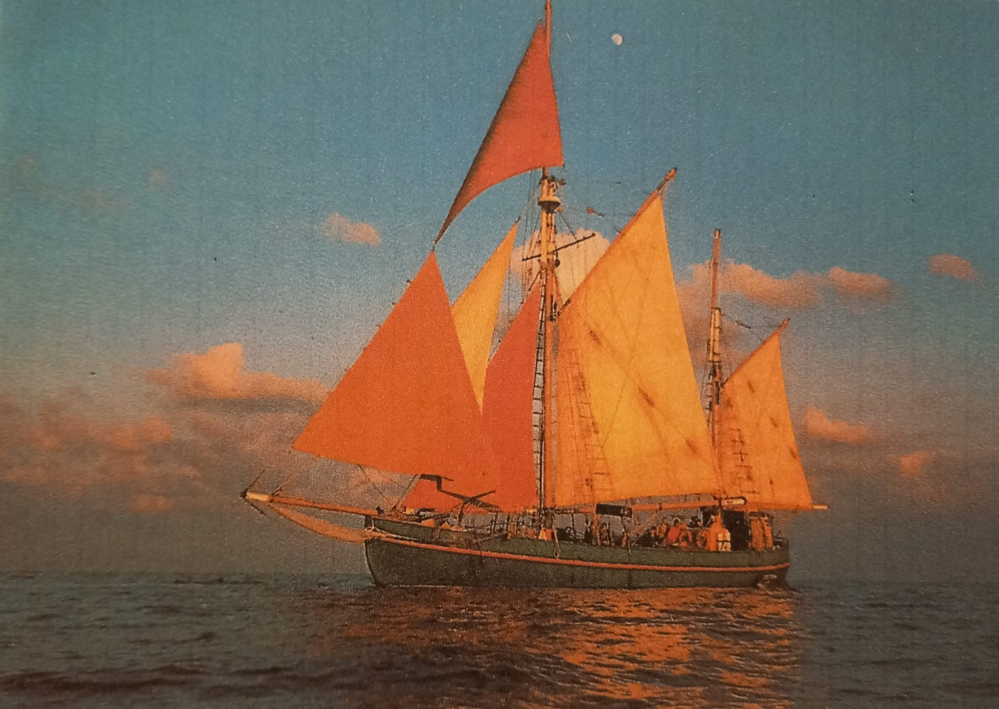
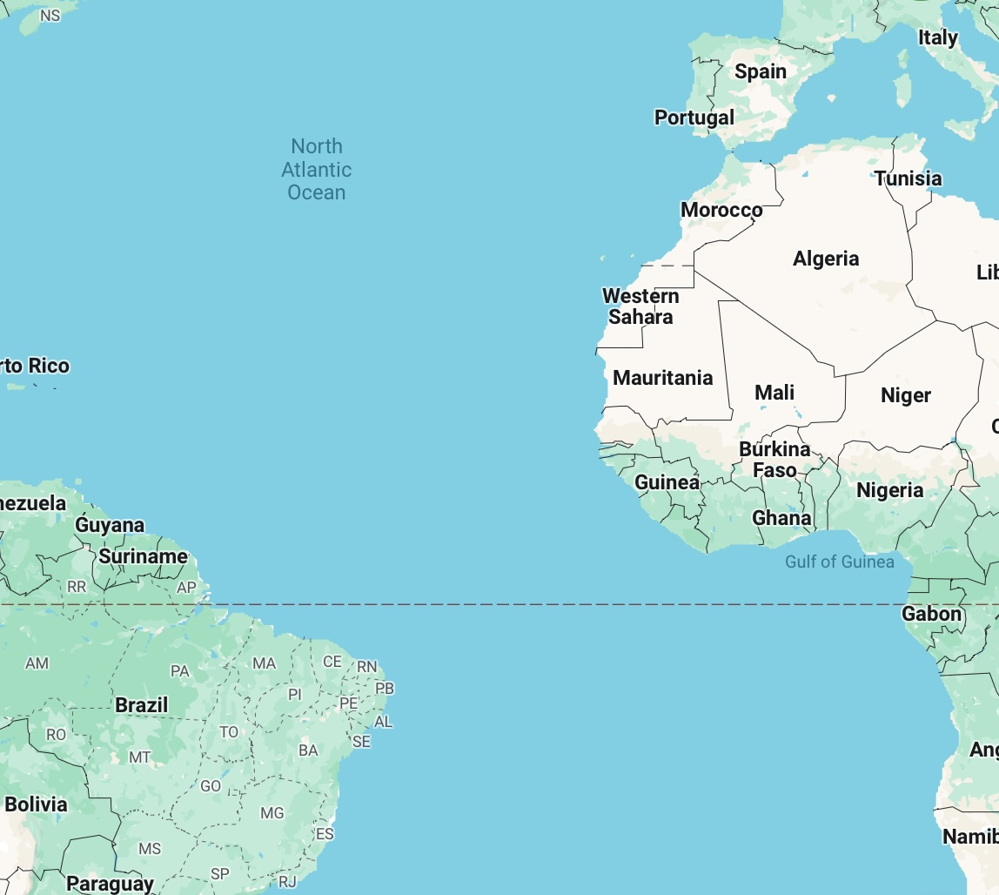

+++
title = "Weg von den Drogen in einen neuen Lebensabschnitt segeln"
date = "2024-03-01"
draft = false
pinned = false
tags = ["Reportage", "Segeltour", "Drogenabhängige"]
image = "img_0085.jpeg"
+++
##### Ein Neuanfang- Die Segeltour für Drogenabhängige im Entzug. Schaffen die Jugendlichen es durch diese Reise auf dem Segelschiff Tectona, weg von den Drogen zu gelangen, zurück in die Gegenwart? Dies ist ihnen selbst überlassen, es liegt in ihrer eigenen Hand. Können sie es Packen oder lassen sie ihr Leben an sich vorbeirauschen? Auf der Tectona nimmt diese lebensverändernde Reise ihren Lauf.

> Thérèse Zöller (Pseudonym) begibt sich auf eine Reise übers offene Meer. Sie ist 73 jährig und lebt am Thunersee. Schon immer war sie begeistert von Schiffen und liebte sie das Meer. Sie hat mit ihren Söhnen, ein Segelpadent für auf offene See absolviert. Sie ist Sozialpädagogin und als Begleiterin auf dem Segeltörn mit Ex-Drogenabhängigen dabei. %

***Die Reise auf der Tectona***\
Am Horizont die Sonne beim Aufgehen, Wind im Gesicht, unter den Füssen nasse Planken, die Hände auf der eisigen metallenen Reling der Tectona. In der frischen Luft hängt ein Geruch von Meeressalz. Die lauten Stimmen von Jugendlichen, denen Anweisungen zugeteilt werden, treten in den Hintergrund und verstummen.

Sozialpädagogin Thérèse Zöller ist von September 1994 bis März 1995 als Begleiterin auf einer abenteuerlichen Reise dabei: Der Sommertörn, welcher von der **Organisation Plus Schweizer Jugend zur See** geführt wird. Dieser Segeltörn dient als anschliessende Therapie für Drogenabhängige Jugendliche nach dem Entzug.

***Aufgaben***\
Sie als Soziapädagogin ist verantwortlich für das Verhalten der Jugendlichen. Die weiteren Begleiter sind der erfahrene Kapitän der das Sagen übers Schiff hat, der Co-Skipper, der auf dem Deck arbeitet, und die Zahlmeisterin, die die Verantwortung hat die Buchhaltung und das Journal mit den Ereignissen der Reise zu führen.%

***An Deck***\
Hier steht Thérèse Zöller auf dem Segelschiff, welches in Indien aus Tiekholz gebaut wurde, und spürt ein abruptes Hin- und Herschwanken der Wellen unter ihren Füssen. Sie lässt die Sonne durch ihre Windjacke sickern. Dies treibt die Kälte des Windes weg, die Anspannung aber bleibt, die ist zu gross, um weggetrieben zu werden. Denn es gilt immer wachsam zu sein, aufzupassen, alles unter Kontrolle zu behalten, den Erwartungen gerecht zu werden und die Augen offen zu halten. Ihr Blick schweift in die Ferne, rings herum das Meer, das sich bis zum Horizont erstreckt. Diese Umgebung wird sie die nächsten sieben Monate begleiten.

> ”Es gilt, immer die Augen offen zu halten.”     

Eine Angelschnur schnallt durch die Luft. Da fällt ihr Fokus auf den Jüngsten der Jugendlichen. Er wirft die Fischerrute über die Reling ins Wasser und fischt begeistert. Mit seinen scharfen Augen verfolgt er, wie die Angelschnur runter saust, in die wilden Wellen hinein, der weisse Schaum spritzt aus dem tiefen Blau hervor. Die Fische die er fängt, werden an Deck zubereitet und genussvoll verschlungen. Dies ist ein Erfolgserlebnis für ihn.\
Nun schweift ihr Blick zurück an Bord, den Herausforderungen entgegen.\
Hier sieht sie die anderen sechs Jugendlichen. Insgesamt sind es zwei Frauen und fünf Männer, 17- bis 25-jährige Schweizer und Spanier. Sie haben viel erlebt und angerichtet, bis sie von den Jugendanwaltschaften auf diesen Törn geschickt wurden. Um wegzukommen von ihren alten Muster.

Eine Jugendliche beobachtet fliegende Fische, wie sie über das Deck springen, hinauf in den Himmel. Schaut man zum Himmel hinauf, sieht man die grossen Masten und die Segel in ihren prächtigen Farben von Weinrot zu Safran gelb, welche die Crew über die offenen Meere tragen. 

***Route***\
Von Spanien, **Vilanova i la Geltrú**, segelten sie übers **Alboràn Meer** durch die **Strasse von Gibraltar** nach **Almeria**, weiter nach **Ceuta**, eine spanische Enklave an der nordafrikanischen Küste, weiter nach **Gibraltar** an der Südküste Spaniens zu den Inseln in Portugal, **Madeira** und **Parto Santo**. Danach ankerten sie bei der Inselgruppe in Afrika, **Capo Verde**, und steuerten weiter Richtung **Azoren**. Auf dem Rückweg mussten sie einen Umweg über die **Balearen** machen und legten beim **Hafen von Horta** auf der Insel **Faial** *an.* Sie ankerten auch in **Pico** und **Càdiz**, danach ging es weiter Richtung Marokko, **Tanger**, und schliesslich über die Spanischen Inseln **Formentera** und **Ibiza** retour.

***Herausforderungen***\
Auf dem Weg, wird die Tour von hartem Unwetter und schlechten Windbedingungen begleitet. Man weiss nie, was einem auf offenem Meer erwartet. Es zerschlägt ein Teil des Schiffes und erst, nachdem man es repariert hatte, konnte die Crew die Reise fortsetzen. Jeder Tag ist ein neues Abendteuer, gefüllt mit der Routine des Alltages, welche es als Team zu meistern gilt. Sie waschen, schruppen, kochen und bunkern Nahrung für die nächsten Tage ihrer Reise. %

Hier an Deck, müssen sie lernen den Herausforderungen ins Auge zu schauen. Damit haben sie zu kämpfen. Auf dem offenem Meer gibt es keinen Ausweg, kein Land in Sicht, um wegzurennen und der Realität auszuweichen. Aber bei jeder Chance, die sie kriegen, versuchen sie, einen Ausweg zu finden. An ihren Gewohnheiten der Vergangenheit sind sie noch immer stark gebunden, und das Verlangen nach dem Konsum von Drogen bleibt pressent. Sie Versuchen, denn Begleitern, um den Finger zu wickeln und hinters Licht zu führen. 

Als die Tectona am Hafen Horta anlegte, kam das Land in Sicht, die Verlockung kam zurück. Die Drogenhändler, die versuchten auf dass Schiff zu gelangen um den Jugendlichen Drogen zu überreichen. Diese musste man mit den Paddeln weg scheuchen. Es gelang nicht immer, alle Drogen fernzuhalten. Auch Alkohol kam ins Spiel. Die Jugendlichen haben schlaue Pläne geschmiedet und eines Nachts entpuppte sich, dass sie die unschuldig aussehenden Tetrapacks mit Wein gefüllt hatten, Weinrot wie die Segel. Damit füllten sie sich ab und der Jüngste fiel in ein Delirium. Dies Erschrak die Jugendliche und die Crew packte gemeinsam an, um ihn aus diesem kritischen Zustand zu helfen.

***Verhängnis***\
Die Jugendlichen müssen der Versuchung wiederstehen, wieder in die alten Muster zu fallen. Man will diese durchbrechen, genau wie das Schiff die Wellen. Dies muss ihnen beigebracht werden, sie müssen lernen sich davon fernzuhalten. Es war die Aufgabe der Leiter, die Aufsicht zu halten, auf die Jugendlichen aufzupassen und darauf zu schauen, dass sie auf dieser Reise clean bleiben. Es mag zwar unsanft sein, aber dies ist nötig, um am Ziel anzukommen und den Anker senken zu können.

> “Die Jugendlichen müssen der Versuchung meiden wieder in die alten Muster zu fallen. Man will diese durchbrechen genau wie das Schiff die Wellen.”

Zu jeder Zeit aufmerksam zu sein, ist eine harte Challenge. Es ist eine grosse Verantwortung, die schwer auf den Schultern lastet. Man will ihr gerecht werden, die Jugendlichen auf der Reise begleiten und sicher wieder zurückbringen. In der Hoffnung, dass sie es packen können, wieder in die Gesellschaft einzusteigen. Damit sie ihr eigenes Leben führen können.%

Die Jugendlichen erwischen die Zahlmeisterin beim Drogenkonsum. Das ist für sie ein gefundenes Fressen, welches sie zu ihren Gunsten brauchen. Die Zahlmeisterin hat bei ihrer Aufgabe verfehlt, sie ist schwach und abhängig. Diese Schwäche brauchen die Jugendlichen gegen sie. Sie haben die Zahlmeisterin direkt unter Kontrolle und können so den Leitern hinter dem Rücken gehen. Dies setzt das Konzept ausser Balance, gibt ein Riss in die Reise, ein Strich durch die Rechnung. Vertrauen geht verloren und die Zahlmeisterin muss fristlos gehen.%

Jeder kann in Drogen reinschlittern und dies wird einem früher oder später zum Verhängnis, denn sie sind unkontrollierbar und zieht einem in den Bann. Dies zu vermeiden oder zu entkommen, braucht Kraft, aber es lohnt sich, denn so findet man wieder zu sich selbst und zu den wichtigen Werten im Leben. Ansonsten rauscht es, wortwörtlich, an einem vorbei.%

Der Schritt weg von den Drogen ist ein grosser und es ist einfach wieder hineinzuschlittern. Die Jugendlichen sind instabil und hängen an einem Faden. Sie drücken sich mit grosser Frustration, Wut und einem Haufen Emotionen aus.\
Auch das Wetter hatte seine Schwankungen, auch hiermit musste sich die Crew auseinandersetzen. Bei einem grossen Sturm schlugen die Regentropfen in die Gesichter, es sah aus, als liefen ihnen Tränen die Wangen hinunter. Wegen dem Umwetter mussten sie mit dem Segelschiff Umwege machen. Auch um unter den Jugendlichen Fortschritte zu erreichen, brauchte es Umwege, manchmal Rückschritte. Die Jugendliche schlossen sich zusammen und waren ein starkes Team.%

***Begegnungen***\
Auf der Reise sehen sie Wahle, die unter dem Schiff schwimmen und mit ihrer mächtigen Flosse die Oberfläche durchbrechen. Auch Meeresschildkröten und Schmetterlinge können sie mit Bewunderung beobachten. Sie entdecken neue Länder und Inseln weit draussen im Meer.

Um an Deck das ganze Geschehen zu kontrollieren halten die Leiter Schichtweise Wache.\
Bei ihren Wachen blickt Therese Zöller Tag und nachts, über das Meer und erblickt dabei am Horizont, wie die Sonne rauf und runtergeht. Dies ist wohl der schönste Teil, ihres strengen Tagesablaufes. Dieser Moment erfüllt sie mit neuer Energie, für den kommenden Tag.

***Outcome***\
Diese Reise war eine Bereicherung es gab einem einen Einblick ausserhalb von 0815, welches wertvoll ist und sich lohnt, auch für die in der Norm. Gerade dort mag das Liegen, wovon man etwas lernen kann. Jeder verdient eine zweite Chance und es ist ein schönes Erlebnis, den Jugendlichen durch diese Segeltour eine zu geben.

> ‘’Ausserhalb der Norm liegt etwas von enormer Wichtigkeit, auch für die in der Norm.’’

Die Sonne wärmte ihre Lederjacke, nun tritt sie hinein in den lebendigen Zürcher Bahnhof, ihr stets noch wachsamer Blick schweift durch die Menschenmenge. Und hier erblickt sie, dass Jüngelchen der Segeltörn, nun ist er junger Mann. Sein Blick ist auf seine Freundin gerichtet, mit der er Arm in Arm durch die Bahnhofshalle schlendert. Ein Lächeln, wie sie es auf der Segeltörn noch nie gesehen hatte, auf seinem Gesicht, er hat es gepackt. Die lauten Stimmen der umherhuschenden Leute treten in den Hintergrund und verstummen. Zu wissen das einer der Jugendlichen es geschafft hat, ist die grösste Belohnung. Auch wen es nur einer ist, nur einer der es schafft, ist es jede Anstrengung wert. Dies zeigt einem, dass sich die harte Arbeit ausgezahlt hat und dass sich die Segeltörn gelohnt hat.

> ”Wen es auch nur ein Jugendlicher ist, der es schafft die Drogen hinter sich zu lassen und in ein neuen Lebensabschnitt zu segeln, lohnt sich die Segeltour”

Es fühlte sich an, als sickerte die Wärme der Sonnenstrahlen durch ihre Lederacke, auch wenn sie hier im Bahnhof nicht zu sehen ist. Obwohl sie nicht mehr auf dem Schiff ist, spürt sie das Schwanken der Wellen und sieht die Sonne wie sie untergeht. Der wunderschöne Sonnenuntergang, in seinen prächtigen Farben, die sie durch diese Reise durch getragen haben.